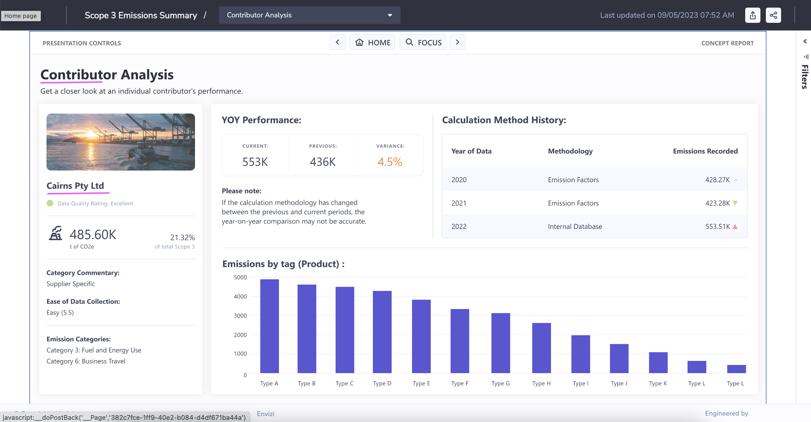

# Understanding Reports and Dashboards in Envizi

In this article, let us understand about the various reports and dashboards available in IBM Envizi ESG suite.

There are 4 types of reports available in Envizi.
- Dashboards
- Power Reports
- Extract Reports
- Envizi API

# 1 Dashboards

Dashboards are interactive pages that allow the reporting and display of data in a visual format.

Dashboards are available at all levels (Organizational, Group, Location, Account, Meter) generally where there is a Summary page:

Here is the peformance dashboard of the entire organization.

Several controls are available in Dashboard.

- `Compare With` compares the current period with other periods.
- `View As` specifies the Unit of measure for the data in the dashboard. 
- `Time slider` indicates the current period chosen to display.
- The `filter` funnel activates the filtering options available: Groups, Measures, Regions, Locations.
-`Actions` activates the Email dashboard or Schedule a Dashboard options

## 1.1 Available Dashboards

At each level there are some dashboards available. Here is the list of important Dashboards available in Envizi.

<table>
    <theader>
        <td>Category</td>
        <td>Report Name</td>
        <td>Details</td>
    <theader>
    <tr>
        <td rowspan=9>Performance</td>
        <td>Organization Summary</td>
        <td>

[Detail](./abcd)</td>
    </tr>
    <tr>
        <td>Performance</td>
        <td>[Detail](https://github.com/GandhiCloudLab/envizi-reports/tree/main/50-org-performance)</td>
    </tr>
    <tr>
        <td>Performance by Data Type</td>
        <td>[Detail](https://github.com/GandhiCloudLab/envizi-reports/tree/main/50-org-performance#user-content-9-performance-by-data-type)</td>
    </tr>
    <tr>
        <td>Performance by Group</td>
        <td>[Detail](https://github.com/GandhiCloudLab/envizi-reports/tree/main/50-org-performance#user-content-10-performance-by-group)</td>
    </tr>
    <tr>
        <td>Performance by Scope</td>
        <td>[Detail](https://github.com/GandhiCloudLab/envizi-reports/tree/main/50-org-performance#user-content-11-performance-by-scope)</td>
    </tr>
    <tr>
        <td>Performance by Tag</td>
        <td>[Detail](https://github.com/GandhiCloudLab/envizi-reports/tree/main/50-org-performance#user-content-12-performance-by-tag-type)</td>
    </tr>
    <tr>
        <td>Performance Trend</td>
        <td>[Detail](https://github.com/GandhiCloudLab/envizi-reports/tree/main/50-org-performance#user-content-13-performance-trend)</td>
    </tr>
    <tr>
        <td>Emissions Performance</td>
        <td>[Detail](https://github.com/GandhiCloudLab/envizi-reports/tree/main/51-org-emission-performance)</td>
    </tr>
    <tr>
        <td>Energy Production</td>
        <td>[Detail](https://github.com/GandhiCloudLab/envizi-reports/tree/main/51-org-emission-performance#user-content-15-energy-production)</td>
    </tr>
    <tr>
        <td rowspan=5>BENCHMARKS</td>
        <td>Ranking Locations by Intensity</td>
        <td></td>
    </tr>                
    <tr>
        <td>Ranking Locations by Ratio</td>
        <td></td>
    </tr>     
    <tr>
        <td>Ranking Groups by Intensity</td>
        <td></td>
    </tr>
    <tr>
        <td>Rate Analysis</td>
        <td></td>
    </tr> 
    <tr>
        <td>Energy Star Portfolio</td>
        <td></td>
    </tr> 
    <tr>
        <td rowspan=2>SOLAR</td>
        <td>Solar Portfolio</td>
        <td></td>
    </tr> 
    <tr>
        <td>Solar Performance and Payback</td>
        <td></td>
    </tr> 
    <tr>
        <td rowspan=3>METER ALERTS</td>
        <td>Summary</td>
        <td></td>
    </tr> 
    <tr>
        <td>Manage Rules</td>
        <td></td>
    </tr> 
        <tr>
        <td>Notifications</td>
        <td></td>
    </tr> 
    <tr>
        <td rowspan=3>ISSUES</td>
        <td>Summary</td>
        <td></td>
    </tr>     
    <tr>
        <td>Scheduled Issues</td>
        <td></td>
    </tr>   
    <tr>
        <td>All Boards</td>
        <td>[Detail](./abcd)</td>
    </tr>           
</table>

## 1.2 How to access Dashboards

Here are some dashboards available globally at the organization level. They can be accessed via several menus in Envizi.

#### Organization Level
Here are the links to various dashboards available at the organization level. To access a dashboard, you could choose a menu item available in the first section (hightlighted in dotted light blue line) of the each menu.

#### Group Level
Here are the links to various dashboards available at the group level. 

#### Location Level
Here are the links to various  dashboards available at the location level. 

#### Account Level
Here are the links to various  dashboards available at the account level. 

## 1.3 Dashboards in Detail

Let us explore a dashboard in detail.

Here is the Organization Summary dashboard. The dashboard contains various information such as Emission, Costs, Summary and DayType Summary. 

# 2. Power Reports

Envizi PowerReport is supercharged by Microsoft PowerBI. Envizi content powered by PowerReport provides a range of visual dashboards to support reporting.

## 2.1 Available Power Reports

Here are the some of the important Power Reports available.

<table>
    <theader>
        <th>Category</th>
        <th>Report Name</th>
        <th>Detail</th>
    </theader>
    <tr>
        <td rowspan=3>Base Platform</td>
        <td>Sustainability (Executive Report)</td>
        <td>

[Detail](https://github.com/GandhiCloudLab/envizi-reports/tree/main/01-sustainability-executive-report)</td>
    </tr>
    <tr>
        <td>Sustainability (Portfolio Performance)</td>
        <td>

[Detail](https://github.com/GandhiCloudLab/envizi-reports/tree/main/12-sustainability-portfolio-performance)</td>
    </tr>
    <tr>
        <td>Account Data Health Check</td>
<td>

[Detail](https://github.com/GandhiCloudLab/envizi-reports/tree/main/11-account-data-health-check)
</td>
    </tr>
    <tr>
        <td rowspan=3>Configurable Content</td>
        <td>Market-based Emissions</td>
        <td>

[Detail](https://github.com/GandhiCloudLab/envizi-reports/tree/main/10-market-based-emissions)</td>
    </tr>
    <tr>
        <td>CDP Climate Report</td>
        <td>

[Detail](https://github.com/GandhiCloudLab/envizi-reports/tree/main/03-cdp)</td>
    </tr>
    <tr>
        <td>Scope 3 Emissions</td>
        <td>

[Detail](https://github.com/GandhiCloudLab/envizi-reports/tree/main/06-scope3-emissions-report)</td>
    </tr>
    <tr>
        <td>Programs</td>
        <td>Programs Overview </td>
        <td>

[Detail](https://github.com/GandhiCloudLab/envizi-reports/tree/main/08-programs-overview)</td>        
    </tr>
    <tr>
        <td rowspan=5 >Others</td>
        <td>Envizi CSR Report</td>
        <td>

[Detail](https://github.com/GandhiCloudLab/envizi-reports/tree/main/02-csr-report)</td>        
    </tr>
    <tr>
        <td>Programs Savings</td>
        <td>

[Detail](https://github.com/GandhiCloudLab/envizi-reports/tree/main/09-programs-savings)</td>        
    </tr>
    <tr>
        <td>Utility Account Analytics</td>
        <td>

[Detail](https://github.com/GandhiCloudLab/envizi-reports/tree/main/07-utility-account-analytics)</td>
    </tr>
    <tr>
        <td>Turbonomic Performance Dashboard</td>
        <td>

[Detail](https://github.com/GandhiCloudLab/envizi-reports/tree/main/40-turbonomic-performance-dashaboard)
        </td>        
    </tr>
</table>

## 2.2 How to access Power Report

1. Click on `Reports > PowerReports`

You will have power report list.

2. Click on any of the report.

The report get displayed.

3. You can also search for the report in the Global Search

4. From the search result choose the appropriate report.

## 2.3 Power Report in Detail

Lets us one of the Power Report called `Scope 3 emissions Report` in detail.

#### 1. Open the Report

Open the report using the Reports search

###### 2. Report Home

Here is the report home page.

Click on the `>` to goto the next page

#### 3. Emissions Dashboard

Select the `Category 1 - Purchased ...`  and then

Click on the `Select a category to enable drill through` button.

#### 4. Category Analyis

Category Analyis get displayed.

Click on the `>` to goto the next page

#### 5. Contributor Dashboard

Contributor Dashboard is displayed.

Select the `Cairns Pty Ltd`  and then

Select the `contributor to enable drill through` button

#### 6. Contributor Analysis

Contributor Analysis get displayed.

Click on the `>` to goto the next page

#### 7. Data Gaps and Opportunities

Data Gaps and Opportunities Analysis get displayed.

Hover the circle to see the details in the tooltip.

#### 8. Various links

Here are the various links available to navigate to the above discussed screens.

## 2.4 PowerReport Edit

The exisitng power report can be saved as a new copy and you can edit the report if you have 

 PowerReports can be edited and saved and kept private or shared with other Envizi users within your organization. The users with the PowerReport Edit work role can do this.

Here are the steps to edit the power report.

1. Open a Power report that you are interested.
2. Click on `Save a Copy` button.

3. Enter the name and Click on `Save` button.

4. Report cretaed and saved. Click on `View Report` button.

5. The report is opend for view. Click on `Edit` button.

6. Make the changes.

7. Report gets saved. 

## 2.5 PowerReport Datasets

PowerReport Datasets are the `datasources` for the Power Reports in Envizi.  

PowerReports can be viewed, edited and saved, and shared with other Envizi users within the organization.  

Customers wishing to create their own reports or modify existing ones needs to utilize this dataset as a data source.

Here are the 3 datasets available in Envizi.

#### Monthly Dataset

The Monthly Dataset is an extensive collection of `monthly aggregated data` from your Envizi platform. It forms the backbone of most Standard PowerReports across various modules and serves as a foundation for creating impactful custom reports within the Envizi platform.

#### Survey Dataset

The Survey Dataset facilitates reporting on `surveys and scorecards` in Envizi’s PowerReport framework.

The dataset `includes all survey responses` for all surveys where at least one question has been answered. Survey responses from locations where no answers have been provided by respondents will be excluded from the dataset.

#### Daily Dataset

This dataset comprises various `daily metrics` obtained from `interval meter data`. This dataset is included as part of the Interval Meter Analytics module.

# 3 Extract Reports

IBM Envizi reports allow users to specify a range of selection criteria to view the data in screen and download and to send the report in mail.

Extracting reports provides the following options.
- Choose from various delivery methods (screen, email)
- Choose Groups, locations, Regions, Utilities, report time period/end date
- Choosing `Create Report and E-mail it now` in CSV, PDF, XLSX format
- Choosing `Schedule Report and E-mail it later` also adds the Daily, Weekly, ...etc. schedule.

Click Submit to run the report based on the selected parameters.

## 3.1 Available Extract Reports

Here are the some of the important Extract Reports available.

<table>
    <theader>
        <td>Category</td>
        <td>Report Name</td>
        <td>Description</td>
    <theader>

<tr>	<td>	Data Management	</td><td>	Account Style Data Extract	</td><td>	This report extracts account items for a single account style	</td>	</tr>
<tr>	<td>	Data Management	</td><td>	Annual Data Summary	</td><td>	Shows annualized data held in all the accounts and meters for selected  locations	</td>	</tr>
<tr>	<td>	Data Management	</td><td>	Monthly Data Summary Report	</td><td>	Shows all monthly data held in all the accounts and meters for selected  locations	</td>	</tr>
<tr>	<td>	Data Management	</td><td>	Survey Responses	</td><td>	This report creates a csv file that contains all the survery responses captured	</td>	</tr>
<tr>	<td>	Emissions, Energy and Sustainability	</td><td>	Consumption  Summary Report	</td><td>	It provides a comprehensive review of the CO2e attributable to a location	</td>	</tr>
<tr>	<td>	Emissions, Energy and Sustainability	</td><td>	Emission and Energy Factors	</td><td>	This report lists the factors used to calculate the GHG emissions and energy consumed or produced within your organization.	</td>	</tr>
<tr>	<td>	Emissions, Energy and Sustainability	</td><td>	Emission Sources Summary Report	</td><td>	This report shows how much was consumed (kWh, L of fuel, etc.) at all locations and how much CO2e was emitted as a result.	</td>	</tr>
<tr>	<td>	Emissions, Energy and Sustainability	</td><td>	Emissions by GHG Type	</td><td>	This report summarizes emissions by Greenhouse Gas.	</td>	</tr>
<tr>	<td>	System Setup Reports	</td><td>	Account Style Extract	</td><td>	This report lists all account styles in Envizi and their associated data type, sub type, field names (C1-C40) and account style rules.	</td>	</tr>
<tr>	<td>	Emissions, Energy and Sustainability	</td><td>	Energy Consumption Detailed	</td><td>	his report shows activity data in native units and energy in GJ for all locations across your organization.	</td>	</tr>
<tr>	<td>	EPA Energy Star Reports	</td><td>	Energy Star Ratings	</td><td>	extracts Energy Star ratings details that have been captured in Location Ratings	</td>	</tr>
<tr>	<td>	Extract Reports	</td><td>	Attachment Summary	</td><td>	provides a list of attachments across the Organization from Organization, Group, Location, Account and Meter levels	</td>	</tr>
<tr>	<td>	Extract Reports	</td><td>	Audit History Report	</td><td>	This report lists all changes made by a specified user within a company for the selected period.	</td>	</tr>
<tr>	<td>	Extract Reports	</td><td>	Extract for Accounts	</td><td>	The report details account info such as account style, data type, location name and etc	</td>	</tr>
<tr>	<td>	Target Reports	</td><td>	Monthly Performance - Actual vs Target and Budget	</td><td>	Report compares the actual consumption in native units and cost  for a selected period	</td>	</tr>

</table>

## 3.2 How to extract the report

1. Enter a report name in the Gobal Search. Ex: Monthly Data Summary

It will display the report in the search results.

2.  You can click on the report

It shows the report home page.

3. Click on the second page arrow in the top to go to next page.

The second page is displayed.

4. Click on & DOWNLOAD AS CSV button to download the report in csv format.

The csv file looks like this.

# 4 Envizi API

The Envizi API helps to export data from the Envizi platform and allows users to access and retrieve data from Envizi directly through compatible third party software, such as Microsoft Excel, Tableau or Power BI, without the need to log in to Envizi's main user interface. This process is secured and it enables the users to create and consume custom dashboards and reports.

The Envizi API is built on top of Envizi's existing reporting framework. A selective list of Envizi reports can be exposed as APIs after going through a certification and validation process. With the Envizi API, users are able to get data in a pre-defined tabular report format which allows for further BI analysis and manipulation in the client tool. 

Techically, Envizi API is a Web Service API which employs RESTful architecture and returns data in JSON format. 

Using the APIs you can able to do the following.
- Retrieve report names
- Retrieve report parameters
- Retrieve report data

Refer the below article to understand about How to use Envizi API.

Use APIs to expose Envizi data to external systems
https://developer.ibm.com/articles/use-apis-to-expose-envizi-data-for-external-systems/

