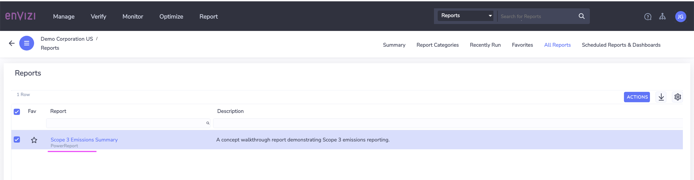

# Understanding Reports and Dashboards in Envizi

In this article, let us understand about the various reports and dashboards available in IBM Envizi ESG suite.

There are 4 types of reports available in Envizi.
- Dashboards
- Power Reports
- Extract Reports
- Envizi API

# 1 Dashboards

Dashboards are interactive pages that allow the reporting and display of data in a visual format.

Dashboards are available at all levels (Organizational, Group, Location, Account, Meter) generally where there is a Summary page:

Here is the peformance dashboard of the entire organization.

Several controls are available in Dashboard.

- `Compare With` compares the current period with other periods.
- `View As` specifies the Unit of measure for the data in the dashboard. 
- `Time slider` indicates the current period chosen to display.
- The `filter` funnel activates the filtering options available: Groups, Measures, Regions, Locations.
-`Actions` activates the Email dashboard or Schedule a Dashboard options

## 1.1 Available Dashboards

At each level there are some dashboards available. Here is the list of Dashboards available in Envizi.

<table>
    <theader>
        <td>Category</td>
        <td>Report Name</td>
        <td>Details</td>
    <theader>
    <tr>
        <td rowspan=9>Performance</td>
        <td>Organization Summary</td>
        <td>[link](./abcd)</td>
    </tr>
    <tr>
        <td>Organization Summary</td>
        <td>[link](./abcd)</td>
    </tr>
    <tr>
        <td>Performance</td>
        <td>[link](./abcd)</td>
    </tr>
    <tr>
        <td>Performance by Data Type</td>
        <td>[link](./abcd)</td>
    </tr>
    <tr>
        <td>Performance by Group</td>
        <td>[link](./abcd)</td>
    </tr>
    <tr>
        <td>Performance by Scope</td>
        <td>[link](./abcd)</td>
    </tr>
    <tr>
        <td>Performance by Tag</td>
        <td>[link](./abcd)</td>
    </tr>
    <tr>
        <td>Performance Trend</td>
        <td>[link](./abcd)</td>
    </tr>
    <tr>
        <td>Emissions Performance</td>
        <td>[link](./abcd)</td>
    </tr>
    <tr>
        <td>Energy Production</td>
        <td>[link](./abcd)</td>
    </tr>
    <tr>
        <td rowspan=5>BENCHMARKS</td>
        <td>Ranking Locations by Intensity</td>
        <td>[link](./abcd)</td>
    </tr>                
    <tr>
        <td>Ranking Locations by Ratio</td>
        <td>[link](./abcd)</td>
    </tr>     
    <tr>
        <td>Ranking Groups by Intensity</td>
        <td>[link](./abcd)</td>
    </tr>
    <tr>
        <td>Rate Analysis</td>
        <td>[link](./abcd)</td>
    </tr> 
    <tr>
        <td>Energy Star Portfolio</td>
        <td>[link](./abcd)</td>
    </tr> 
    <tr>
        <td rowspan=2>SOLAR</td>
        <td>Solar Portfolio</td>
        <td>[link](./abcd)</td>
    </tr> 
    <tr>
        <td>Solar Performance and Payback</td>
        <td>[link](./abcd)</td>
    </tr> 
    <tr>
        <td rowspan=3>METER ALERTS</td>
        <td>Summary</td>
        <td>[link](./abcd)</td>
    </tr> 
    <tr>
        <td>Manage Rules</td>
        <td>[link](./abcd)</td>
    </tr> 
        <tr>
        <td>Notifications</td>
        <td>[link](./abcd)</td>
    </tr> 
    <tr>
        <td rowspan=3>ISSUES</td>
        <td>Summary</td>
        <td>[link](./abcd)</td>
    </tr>     
    <tr>
        <td>Scheduled Issues</td>
        <td>[link](./abcd)</td>
    </tr>   
    <tr>
        <td>All Boards</td>
        <td>[link](./abcd)</td>
    </tr>           
</table>

## 1.2 How to access Dashboards

Here are some dashboards available globally at the organization level. They can be accessed via several menus in Envizi.

#### Organization Level
Here are the links to various dashboards available at the organization level. To access a dashboard, you could choose a menu item available in the first section (hightlighted in dotted light blue line) of the each menu.

#### Group Level
Here are the links to various dashboards available at the group level. 

#### Location Level
Here are the links to various  dashboards available at the location level. 

#### Account Level
Here are the links to various  dashboards available at the account level. 

## 1.3 Dashboards in Detail

Let us explore a dashboard in detail.

Here is the Organization Summary dashboard. The dashboard contains various information such as Emission, Costs, Summary and DayType Summary. 

# 2. Power Reports

Envizi PowerReport is supercharged by Microsoft PowerBI. Envizi content powered by PowerReport provides a range of visual dashboards to support reporting.

## 2.1 Available Power Reports

Here are the some of the important Power Reports available.

<table>
    <theader>
        <td>Category</td>
        <td>Report Name</td>
        <td>Description</td>
        <td>Detail</td>
    <theader>
    <tr>
        <td rowspan=3>Base Platform</td>
        <td>Sustainability (Executive Report)</td>
        <td></td>
        <td>

[link](https://github.com/GandhiCloudLab/envizi-reports/tree/main/01-sustainability-executive-report)</td>
    </tr>
    <tr>
        <td>Sustainability (Portfolio Performance)</td>
        <td></td>
        <td>

[link](https://github.com/GandhiCloudLab/envizi-reports/tree/main/12-sustainability-portfolio-performance)</td>
    </tr>
    <tr>
        <td>Account Data Health Check</td>
        <td></td>
<td>

[link](https://github.com/GandhiCloudLab/envizi-reports/tree/main/11-account-data-health-check)
</td>
    </tr>
    <tr>
        <td rowspan=5>Configurable Content</td>
        <td>Market-based Emissions</td>
        <td></td>
        <td>

[link](https://github.com/GandhiCloudLab/envizi-reports/tree/main/10-market-based-emissions)</td>
    </tr>
    <tr>
        <td>CDP Climate Report</td>
        <td></td>
        <td>

[link](https://github.com/GandhiCloudLab/envizi-reports/tree/main/03-cdp)</td>
    </tr>
    <tr>
        <td>Scope 3 Emissions</td>
        <td></td>
        <td>

[link](https://github.com/GandhiCloudLab/envizi-reports/tree/main/06-scope3-emissions-report)</td>
    </tr>
    <tr>
        <td>CRREM Modeling Tool</td>
        <td></td>
        <td>

[link](aaa)</td>
    </tr>
    <tr>
        <td>Utility Expense Insights</td>
        <td></td>
        <td>

[link](aaa)</td>        
    </tr>
    <tr>
        <td rowspan=2>Programs</td>
        <td>Programs Overview </td>
        <td></td>
        <td>

[link](https://github.com/GandhiCloudLab/envizi-reports/tree/main/08-programs-overview)</td>        
    </tr>
    <tr>
        <td>Scenario Modeler Tool</td>
        <td></td>
        <td>

[link](./abcd)</td>        
    </tr>
    <tr>
        <td rowspan=5 >Others</td>
        <td>Envizi CSR Report</td>
        <td></td>
        <td>

[link](https://github.com/GandhiCloudLab/envizi-reports/tree/main/02-csr-report)</td>        
    </tr>
    <tr>
        <td>ESG Performance Overview</td>
        <td></td>
        <td>

[link](aaa)</td>        
    </tr>
    <tr>
        <td>Programs Savings</td>
        <td></td>
        <td>

[link](https://github.com/GandhiCloudLab/envizi-reports/tree/main/09-programs-savings)</td>        
    </tr>
    <tr>
        <td>Utility Account Analytics</td>
        <td></td>
        <td>

[link](https://github.com/GandhiCloudLab/envizi-reports/tree/main/07-utility-account-analytics)</td>
    </tr>
    <tr>
        <td>Turbonomic Performance Dashboard</td>
        <td></td>
        <td>

[link](https://github.com/GandhiCloudLab/envizi-reports/tree/main/40-turbonomic-performance-dashaboard)
        </td>        
    </tr>
</table>

## 2.2 How to access Power Report

1. Click on `Reports > PowerReports`

You will have power report list.

2. Click on any of the report.

The report get displayed.

3. You can also search for the report in the Global Search

4. From the search result choose the appropriate report.

## 2.3 Power Report in Detail

Lets us one of the Power Report called `Scope 3 emissions Report` in detail.

#### 1. Open the Report

Open the report using the Reports search

###### 2. Report Home

Here is the report home page.

Click on the `>` to goto the next page

#### 3. Emissions Dashboard

Select the `Category 1 - Purchased ...`  and then

Click on the `Select a category to enable drill through` button.

#### 4. Category Analyis

Category Analyis get displayed.

Click on the `>` to goto the next page

#### 5. Contributor Dashboard

Contributor Dashboard is displayed.

Select the `Cairns Pty Ltd`  and then

Select the `contributor to enable drill through` button

#### 6. Contributor Analysis

Contributor Analysis get displayed.

Click on the `>` to goto the next page

#### 7. Data Gaps and Opportunities

Data Gaps and Opportunities Analysis get displayed.

Hover the circle to see the details in the tooltip.

#### 8. Various links

Here are the various links available to navigate to the above discussed screens.

## 2.4 PowerReport Datasets

PowerReport Datasets helps to create new Power Reports in Envizi. There are 3 datasets available in Envizi.

PowerReports can be viewed, edited and saved, and kept private or shared with other Envizi users within your organization.  This gives users the freedom to navigate and respond to the changing reporting requirements of your organization.

For customers who want to build their own reports, PowerReports can be built using Standard Datasets, available with their relevant modules:

#### Monthly Dataset

The Monthly Dataset is a comprehensive dataset containing monthly aggregated data from your envizi platform. It powers the majority of Standard PowerReports across many modules and can be leveraged to build powerful custom reports directly in the Envizi platform.

A comprehensive dataset containing consolidated monthly data, which includes support for data type groups, ratios, and a range of standard data objects.

#### Survey Dataset

The Survey Dataset supports reporting on surveys and scorecards (Surveys which include scoring) in Envizi’s PowerReport framework.

The dataset includes all survey responses for all surveys that have at least one question answered. If a respondent has not filled in any answers, that Location’s (which could represent a third party like a supplier or investee) survey response will not be included.

A dataset containing survey responses and scoring for scorecard-type surveys.

#### Daily Dataset

A dataset that includes a range of daily metrics derived from interval meter data. This dataset will be supported via the Interval Meter Analytics module.

## 2.5 PowerReport Edit

The exisitng power report can be saved as a new copy and you can edit the report if you have 

 PowerReports can be edited and saved and kept private or shared with other Envizi users within your organization. The users with the PowerReport Edit work role can do this.

Here are the steps to edit the power report.

1. Open a Power report that you are interested.
2. Click on `Save a Copy` button.

3. Enter the name and Click on `Save` button.

4. Report cretaed and saved. Click on `View Report` button.

5. The report is opend for view. Click on `Edit` button.

6. Make the changes.

7. Report gets saved. 

# 3 Extract Reports

IBM Envizi reports allow users to specify a range of selection criteria to view the data in screen and download and to send the report in mail.

Extracting reports provides the following options.
- Choose from various delivery methods (screen, email)
- Choose Groups, locations, Regions, Utilities, report time period/end date
- Choosing `Create Report and E-mail it now` in CSV, PDF, XLSX format
- Choosing `Schedule Report and E-mail it later` also adds the Daily, Weekly, ...etc. schedule.

Click Submit to run the report based on the selected parameters.

## 3.1 Available Extract Reports

Here are the some of the important Extract Reports available.

<table>
    <theader>
        <td>Category</td>
        <td>Report Name</td>
        <td>Description</td>
        <td>Details</td>
    <theader>
    <tr>
        <td rowspan=3>Base Platform</td>
        <td>Sustainability (Executive Report)</td>
        <td></td>
        <td></td>
    </tr>
    <tr>
        <td>Sustainability (Portfolio Performance)</td>
        <td></td>
        <td></td>
    </tr>
    <tr>
        <td>Account Data Health Check</td>
        <td></td>
        <td></td>
    </tr>
    <tr>
        <td rowspan=4>Configurable Report/td>
        <td>Sustainability (Executive Report)</td>
        <td></td>
        <td></td>
    </tr>
    <tr>
        <td>CDP Climate Report</td>
        <td></td>
        <td></td>
    </tr>    
    <tr>
        <td>Scope 3 Emissions</td>
        <td></td>
        <td></td>
    </tr>    
    <tr>
        <td>CRREM Modeling Tool</td>
        <td></td>
        <td></td>
    </tr>    
    <tr>
        <td >Utility/td>
        <td>Utility Expense Insights</td>
        <td></td>
        <td></td>
    </tr>
    <tr>
        <td rowspan=8>Utility/td>
        <td> Utility Expense Insights</td>
        <td></td>
        <td></td>
    </tr>    
    <tr>
        <td>Programs Overview </td>
        <td></td>
        <td></td>
    </tr>    
    <tr>
        <td>Scenario Modeler Tool</td>
        <td></td>
        <td></td>
    </tr>    
    <tr>
        <td>Envizi CSR Report</td>
        <td></td>
        <td></td>
    </tr>    
    <tr>
        <td>ESG Performance Overview</td>
        <td></td>
        <td></td>
    </tr>    
    <tr>
        <td>Programs Savings</td>
        <td></td>
        <td></td>
    </tr>    
    <tr>
        <td>Utility Account Analytics</td>
        <td></td>
        <td></td>
    </tr>
    <tr>
        <td>Turbonomic Performance Dashboard</td>
        <td></td>
        <td></td>
    </tr>     
</table>

## 3.2 How to extract the report

1. Enter a report name in the Gobal Search. Ex: Monthly Data Summary

It will display the report in the search results.

2.  You can click on the report

It shows the report home page.

3. Click on the second page arrow in the top to go to next page.

The second page is displayed.

4. Click on & DOWNLOAD AS CSV button to download the report in csv format.

The csv file looks like this.

# 4 API

The Envizi API promotes sharing of data from the Envizi platform and allows users to access and retrieve data from Envizi directly through to compatible third-party software, such as Microsoft Excel, Tableau or Power BI, without the need to log in to Envizi's main user interface. 

- Envizi API is an add-on feature in freeing up the data within Envizi
- Saves time and streamlines reporting and data analytics needs
- Extract multiple data sets at once
- Reports maintain data connectivity & can be refreshed by a user at anytime
- Combine these data sets to create a single reporting output 
- Envizi can integrate with your organization’s 3rd party reporting tools

Refer the documentation.

Use APIs to expose Envizi data to external systems
https://developer.ibm.com/articles/use-apis-to-expose-envizi-data-for-external-systems/

https://knowledgebase.envizi.com/home/envizi-api-overview
 
